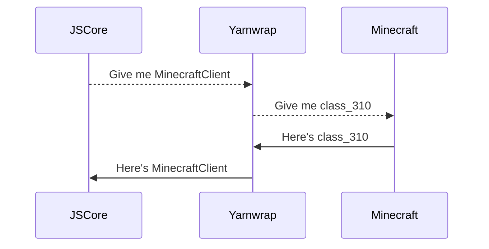

# FabricMC + JavaScript = JSCore

JSCore is a thin wrapper around FabricMC.

## What does this mod do?

This mod provides full JavaScript support for Minecraft modding, you can create or use community modules to customise your game.

In short, JSCore can do
- Everything a typical JS runtime, such as KubeJS, can do.
- Everything in FabricMC that does not use Mixins*
- Interact with other mods.

\*Mixins support depends on whether one guy on Discord can get it to work or not.

## How to use it?

Just download the mod and run the game!

Read the [Quickstart Guide](./quickstart).

## How is it different from KubeJS/JSMacros?

### Access to Minecraft Internals

JSCore allows access to classes in the **net.minecraft** package - anything that FabricMC can do (except Mixins), JSCore can also do it.

```js
// client: net.minecraft.client.MinecraftClient
let client = net.minecraft.client.MinecraftClient.getInstance();
// player: net.minecraft.client.network.ClientPlayerEntity
let player = client.player;
// position: net.minecraft.util.math.BlockPos
let position = player.getBlockPos();
```

### Module System Similar to Node.js

The module system from Node.js allows complex game mechanics to be built from small and managable chunks, so we brought it to JSCore.

```js
// init.js
let savePlayers = require("./savePlayers");
savePlayers();
```

```js
// savePlayers.js
let fs = require("fs");
let { getPlayers } = require("./getPlayers");

function savePlayers() {
    let players = getPlayers();
    let content = JSON.stringify(players);
    fs.writeFileSync("./playerList.json", content);
}

module.exports = savePlayers;
```

## What features does this mod have?

This mod runs **init.js** on start.

Additional features are provided by third-party modules, such as
- **Rinode**: provide Node.js features such as `console.log` and `fs`.
- **Command**: Declarative Minecraft command registration.
- **Pully**: package manager for JSCore.

A list of package can be found in the [package repository](https://github.com/FabricCore/jscore-openrepo?tab=readme-ov-file#all-packages), anyone can publish packages to this repository.

## How does this mod work?

The Minecraft code is obfuscated and cannot be referred to by their real name. This mod uses Yarnwrap, which wraps all **net.minecraft** classes so their real name can be used instead of their obfuscated name.



This mod is still in its early stages, please join [**Discord**](https://discord.gg/XfSZ5tc7Sk) for support or to sway its development.